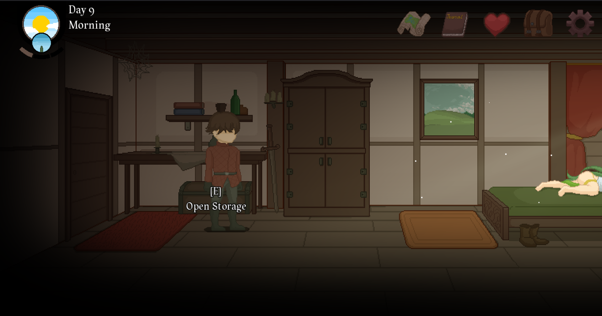

    

# Thou, Eternal Everbloom - Bruteforce System

The system intent is to get Debug Tool's password from Forbidden Book item.

If you really enjoyed the game, help the development by buying in this official [link](https://caffaholic.itch.io/thou-eternal-everbloom).

### Badges

[linuxmint](https://img.shields.io/badge/Linux%20Mint%20-%2022.2%20-%20green?style=flat&logo=linuxmint&logoColor=white&logoSize=auto&labelColor=black&color=%2386BE43)
[python](https://img.shields.io/badge/Python%20-%203.12%20-%20blue?style=flat&logo=python&logoColor=yellow&logoSize=auto&labelColor=black&color=%233968ba)
[thou](https://img.shields.io/badge/Thou%2C%20Eternal%20Everbloom%20-%200.2.0.4%20-%20green?style=flat&logoSize=auto&labelColor=black&color=%23309351)

## Contributing

If you need more info or want to help testing in Windows, feel free to help in this repository.

## Official Notes

If you are officially **Caffaholic** and want me to set this repository private or deleted: 
- First, _nice game bro_; 
- Second, send me a message in my official email that is in my profile 🫡

## Using the system

1. To use this system you'll need to know this system was tested only on Linux Ubuntu Distribution (or, in case, Linux Mint).

2. If you have the first requirements fullfilled, now you'll need to create a `pipenv shell` and download this code inside your virtual environment.

3. After downloaded the system, install the dependences by running `pipenv install` or `pipenv install --dev`.

4. Run the game in window mode and stay in Bedroom like the image (_I only tested this place like in the image_):

    

5. Run the system using `pipenv run thou` and click inside the game less than 5 seconds (after this time, the system will start the loop).

6. (Optional) To stop, just click in terminal and click `Ctrl + C`. Do it quick. 

### How it works?

PyAutoGUI will simulate the keyboard and mouse use. DO NOT USE YOU COMPUTER while the system is working (or use, it will only break the system script btw).
